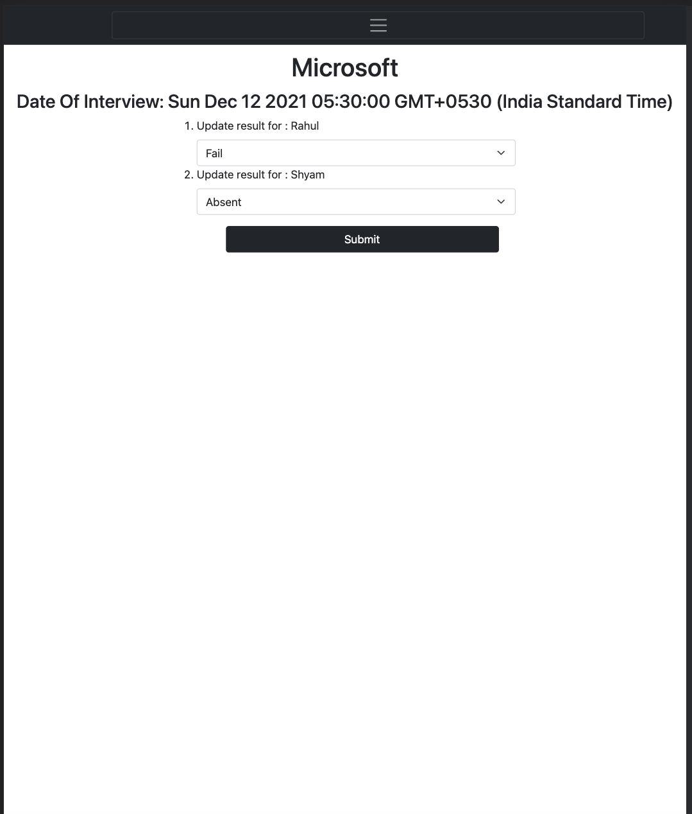

# 🏢 Placement Cell

A company constantly needs to download their data to compile different reports.created an
interface for the employees of this company to fill in the data into the database and then download it in CSV
format.

# Desktop View

## SignUp

## SignIn

## Home Page

## Form to create new Student

## Create New schedule for compony 

## Mark/Update Result of Students for perticular Compony

## Download all results inform of CSV

## SignOut

# Mobile View

## SignIn

## Home Page

## Create New schedule for compony 

## Mark/Update Result of Students for perticular Compony

# Steps to run project Locally

- System should have
    - Nodejs
    - MongoDB

- commonds to run

        npm init
        node index.js

